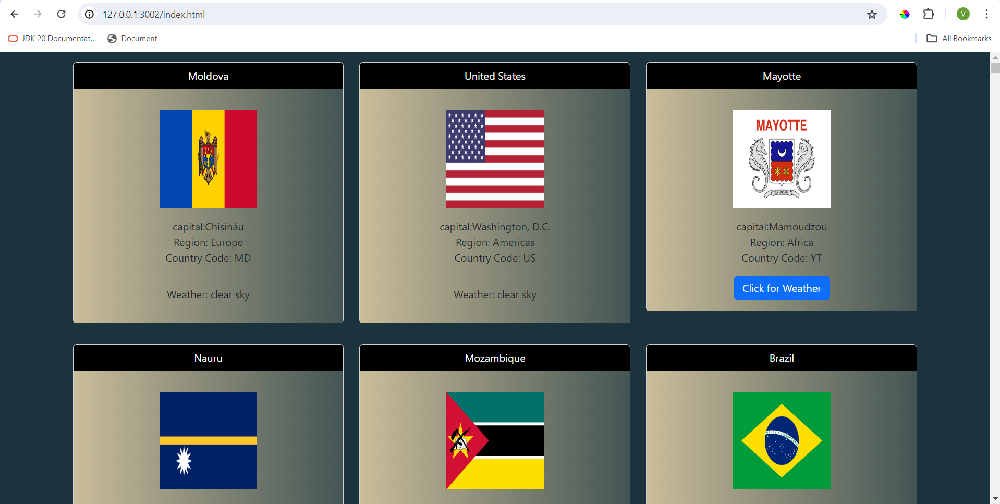

## Problem Description:
 ## Restcountries & Weather using fetch () API

 Implement the rest countries and Open weather map APIs using fetch () API.

 ### Contraints:

 - All your HTML elements should be created with DOM .
 - Use only `fetch() API` to get both rest countries data and open weather .
 - Pass the necessary value from the rest countries API to openweathermap.org to get current weather data of the selected country.
 - Use Bootstrap cards to display the necessary data on the screen.
 - All Javascript codes should be in a script file named `script.js` wgich has to be imported inside of the body element of your `HTML file`.
 - Display the below values in the Bootstrap card.
   - capital
   - Region
   - Latlng
   - Name
   - Flag
   - Country codes

### Project Description:

  Project function in index.js file (script file)

Create a async function to fetch the rescountries data https://restcountries.com/v3.1/all

Create a div tag and create a card,inside card body create list of items
   - countryname
   - capital
   - region
   - countrycode
   - flag

 Create a cardHeader textcontent is country name

Card Body create a div tag and it contains flag image

Create a p tag inside p tag upload capital ,region,country code

Create a button and text content is "click for weather",click button it shows the country weather.

Using async funtion to toggle weather details for each country .

##  Sample Output Screenshot:

